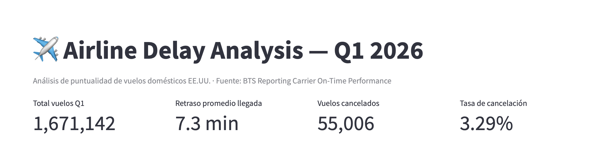

# Dashboard interactivo

Esta carpeta contiene el código del dashboard desarrollado en **Streamlit** y **Plotly** para visualizar los resultados principales del proyecto **Airline Delay Analysis — Q1 2026**.

El dashboard permite explorar el desempeño operativo de vuelos domésticos en Estados Unidos durante enero, febrero y marzo de 2026.

---

## Archivo principal

```text
dashboard.py
```

Para ejecutar el dashboard desde la raíz del proyecto:

```bash
streamlit run dashboard/dashboard.py
```

---

## KPIs generales



La parte superior del dashboard muestra los indicadores generales del periodo analizado:

* Total de vuelos.
* Retraso promedio de llegada.
* Vuelos cancelados.
* Tasa de cancelación.

---

## Visualizaciones

### 1. Ranking de aerolíneas por retraso promedio


Esta gráfica compara el retraso promedio de llegada por aerolínea. Permite identificar qué compañías tuvieron mayores niveles de demora durante el primer trimestre de 2026.

---

### 2. Tendencia diaria de retraso


Esta visualización muestra la evolución diaria del retraso promedio. Ayuda a detectar periodos específicos donde aumentaron las demoras.

---

### 3. Porcentaje de vuelos con retraso mayor a 15 minutos


Esta gráfica muestra el porcentaje de vuelos con retraso mayor a 15 minutos. Permite comparar el comportamiento de los retrasos significativos entre aerolíneas o periodos.

---

### 4. Cancelaciones por causa y mes


Esta gráfica muestra la distribución de cancelaciones por causa y mes. Permite identificar qué factores explicaron la mayor cantidad de vuelos cancelados, como clima, aerolínea, sistema nacional aéreo o seguridad.

---

## Interpretación general

El dashboard resume los principales hallazgos del proyecto de forma visual e interactiva. Las gráficas permiten identificar aerolíneas con mayor retraso promedio, periodos con aumentos relevantes en demoras y causas principales de cancelación.

