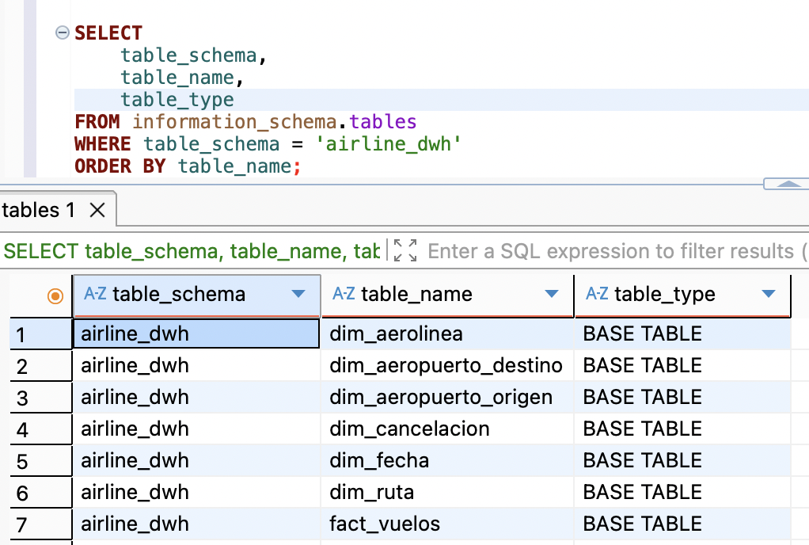
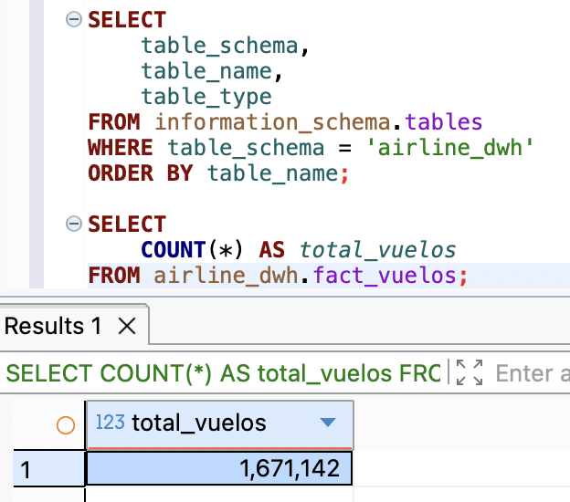
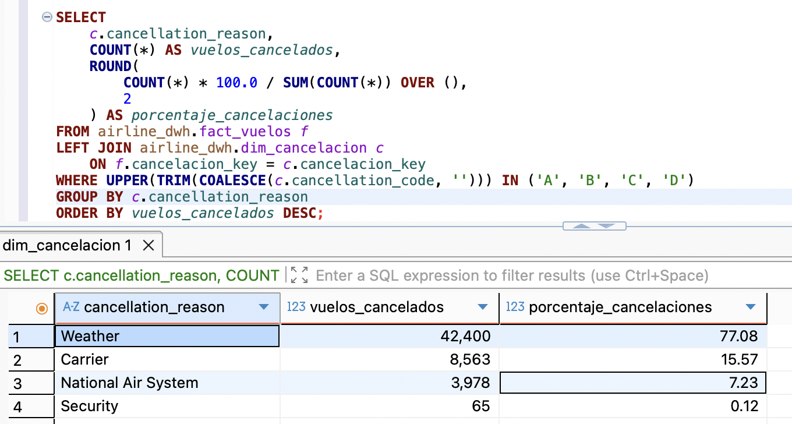

# Evidencias de ejecución en DBeaver

Esta carpeta contiene capturas de validación del modelo dimensional cargado en Aurora PostgreSQL mediante DBeaver.

## 1. Schema y tablas del modelo

La captura muestra el schema `airline_dwh` con las tablas principales del modelo dimensional, incluyendo la tabla de hechos `fact_vuelos` y sus dimensiones asociadas.

## 2. Validación de registros cargados

La consulta valida que la tabla `fact_vuelos` fue cargada correctamente después de ejecutar el proceso ETL.

## 3. Consulta analítica de validación

La consulta muestra una validación analítica sobre las cancelaciones por causa, confirmando que la información cargada en el modelo puede ser consultada correctamente desde DBeaver.
